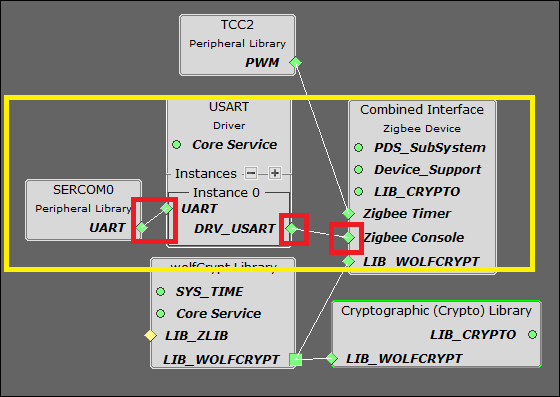
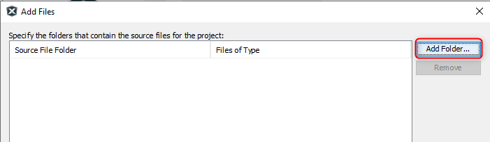
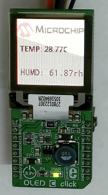

# WBZ45x ZIGBEE COMBINED INTERFACE WITH OLED DISPLAY


> "IOT Made Easy!" 

Devices: **| PIC32CXBZ2 | WBZ45x |**<br>
Features: **| ZIGBEE | OLED |**


## ⚠ Disclaimer

<p><span style="color:red"><b>
THE SOFTWARE ARE PROVIDED "AS IS" AND GIVE A PATH FOR SELF-SUPPORT AND SELF-MAINTENANCE. This repository contains example code intended to help accelerate client product development. </br>

For additional Microchip repos, see: <a href="https://github.com/Microchip-MPLAB-Harmony" target="_blank">https://github.com/Microchip-MPLAB-Harmony</a>

Checkout the <a href="https://microchipsupport.force.com/s/" target="_blank">Technical support portal</a> to access our knowledge base, community forums or submit support ticket requests.
</span></p></b>

## Contents

1. [Introduction](#step1)
1. [Bill of materials](#step2)
1. [Hardware Setup](#step3)
1. [Software Setup](#step4)
1. [Harmony MCC Configuration](#step5)
1. [Board Programming](#step6)
1. [Run the demo](#step7)

## 1. Introduction<a name="step1">

This application demonstrates the integration of the OLED Display and Zigbee (Combined Interface) stack on the PIC32CxBZ2/WBZ451 device. The temperature and humidity measurements from the [Zigbee Multisensor](https://github.com/MicrochipTech/PIC32CXBZ2_WBZ45x_ZIGBEE_MULTISENSOR_TEMPHUM13_CLICK) device are displayed on the OLED C click.


OLED C click features the PSP27801 OLED display, with the resolution of 96x96 pixels. The graphics driver used on this OLED display is the SSD1351, the display driver IC from Solomon Systech with embedded 128x128x18 bit SRAM display buffer. The SSD1351 driver is designed to work with the common cathode type OLED displays. 

## 2. Bill of materials<a name="step2">

| TOOLS | QUANTITY |
| :- | :- |
| [PIC32CX-BZ2 and WBZ451 Curiosity Development Board](https://www.microchip.com/en-us/development-tool/EV96B94A) | 2 |
| [OLED C CLICK](https://www.mikroe.com/oled-c-click) | 1 |
| [TEMP&HUM 13 CLICK](https://www.mikroe.com/temphum-13-click) | 1 |

## 3. Hardware Setup<a name="step3">

- Connect the OLED C CLICK with the WBZ451 CURIOSITY BOARD using the below table.


|     WBZ451    |OLED CLICK | Description |     WBZ451    |OLED CLICK | Description |
| :- | :- | :- | :- |:- | :- |
|     AN        |    15(EN) |    ENABLE   |    PWM        |    16(D/C)|     Data/Command   |
|     RST       |    2(RST) |    RESET    |    INT        |    NC     |     NC      |
|     CS        |    3(CS)  | CHIP SELECT |    RX         |    NC     |     NC      |
|     SCK       |    4(SCK) |    SPI CLOCK   |    TX         |    NC     |     NC      |
|     MISO      |    5(MISO)|    SERIAL DATA OUTPUT     |    SCL        |    NC     |     NC      |
|     MOSI      |    6(MOSI)|    SERIAL DATA INPUT     |    SDA        |    NC     |     NC      |
|     3.3V      |    7(3.3V)|    POWER SUPPLY      |    5V         |    NC     |     NC      |
|     GND       |    8 (GND)|    GROUND      |    GND        |    1(R/WC)|     Read/Write    |

| Note: PIN 1 of OLED should be connected with GND & PIN 15 of OLED should be connected with AN of WBZ451 respectively!! |
| --- |

 

## 4. Software Setup<a name="step4">

- [MPLAB X IDE ](https://www.microchip.com/en-us/tools-resources/develop/mplab-x-ide#tabs)

    - Version: 6.00
	- XC32 Compiler v4.10
	- MPLAB® Code Configurator v5.1.17
	- PIC32CX-BZ_DFP v1.0.107
	- MCC Harmony
	  - csp version: v3.14.1
	  - core version: v3.11.1
	  - CMSIS-FreeRTOS: v10.4.6
	  - wireless_pic32cxbz_wbz: v1.1.0
	  - dev_packs: v3.14.0
	  - gfx: v3.11.1
	  - wolfssl version: v4.7.0
	  - crypto version: v3.7.6
	  - wireless_zigbee: v5.0.0
	    
- Any Serial Terminal application like [TERA TERM](https://download.cnet.com/Tera-Term/3000-2094_4-75766675.html) terminal application

- [MPLAB X IPE v6.00](https://microchipdeveloper.com/ipe:installation)

## 5. Harmony MCC Configuration<a name="step5">

### Getting started with ZIGBEE CI and OLED DISPLAY with WBZ451 CURIOSITY BOARD.

| Tip | New users of MPLAB Code Configurator are recommended to go through the [overview](https://onlinedocs.microchip.com/pr/GUID-1F7007B8-9A46-4D03-AEED-650357BA760D-en-US-6/index.html?GUID-AFAB9227-B10C-4FAE-9785-98474664B50A) |
| :- | :- |

**Step 1** - Connect the WBZ451 CURIOSITY BOARD to the device/system using a micro-USB cable.

**Step 2** - The project graph of the ZIGBEE CI and OLED application is shown below.


**Step 3** - In MCC harmony project graph, Add Legato from Device Resources under Libraries->Harmony->Graphics->Middleware and configure it.


- To add satisfiers as shown below right click on the "⬦" in Legato->LE Display Driver and add the satisfier "LE External Controller" and will prompt an Auto-activation for "GFX Core LE" component, give yes to add the component. 


**Step 4** - In MCC harmony project graph, select LE External Controller and configure as mentioned below.

 

- Use these comments while configuring.

```
Make display ON
SET_REMAP_DUAL_COM_LINE_COMMAND
SET_DISPLAY_START_LINE_COMMAND
```


**Step 5** - In MCC harmony project graph, select GFX Core LE and configure as mentioned below.


- To add satisfiers as shown below right click on the "⬦" in LE External Controller->SPI Display Interface and add the satisfier "LE SPI 4-line" to add the component. 

- Again right click on the "o" in LE External Controller->SYS_TIME and add the satisfier "TIME" and will prompt an Auto-activation for "core"&"FreeRTOS" component, give yes to add the component. 

- Again right click on the "⬦" in TIME->TMR and add the satisfier "TC0" to add the component.


**Step 6** - In MCC harmony project graph, select LE SPI 4-line and add satisfiers by right click on the "⬦" in LE SPI 4-line->DRV_SPI to add the "SPI" component and configure SPI as shown below.


**Step 7** - In MCC harmony project graph, select SPI and add satisfiers by right click on the "⬦" in Instance->SPI to add the SERCOM1 component and configure SERCOM1 as shown below.


**Step 8** - In MCC harmony project graph, Add the Combined Interface from device resources under Libraries->Harmony->wireless->drivers->Zigbee->Device Types and will prompt an Auto-activation for "TRNG","wolfcrypt Library","TCC2","Device_Support","PDS_SubSystem","NVM","Cryptographic" component, give yes to add the component and give yes to Auto-connect.

- In Device_Support add satisfiers by right click on the "⬦" in Device_Support->RTC to add the RTC component.


- Add UART components needed for console logs and commands. Right click on the "⬦" in Zigbee console and add the satisfier and in the same way add SERCOM0 to the USART console. 



**Step 9** - In MCC harmony project graph select the SERCOM0 and configure as shown below.


**Step 10** - In MCC harmony project graph, select wolfCrypt Library and configure as mentioned below.


**Step 11** - In MCC harmony project graph, select system and configure as mentioned below.


**Step 12** - In MCC harmony project graph, select Core and configure as mentioned below.


**Step 13** - In MCC harmony project graph, select FreeRTOS and configure as mentioned below.


**Step 14** - In project graph, go to Plugins->Pin configurations->Pin settings and set the pin configuration as shown below.

- Use these PIN Names while configuring.

```
GFX_DISP_INTF_PIN_CS
GFX_DISP_INTF_PIN_RSDC
GFX_DISP_INTF_PIN_RESET
GFX_DISP_INTF_PIN_EN
```


**Step 15** - [Generate](https://onlinedocs.microchip.com/pr/GUID-A5330D3A-9F51-4A26-B71D-8503A493DF9C-en-US-1/index.html?GUID-9C28F407-4879-4174-9963-2CF34161398E) the code.

**Step 16** - From the unzipped folder copy the folder click_routines(which contains the oled_c.h & oled_c.c) to the folder firmware/src under your MPLAB Harmony v3 application project and add the Header (oled_c.h) and Source file (oled_c.c).

- In the project explorer, Right click on folder Header Files and add a sub folder click_routines by selecting “Add Existing Items from Folders…”


- Click on “Add Folder…” button.


- Select the “click_routines” folder and select “Files of Types” as Header Files.


- Click on “Add” button to add the selected folder.


- The OLED C lick header files gets added to your project.


- In the project explorer, Right click on folder Source Files and add a sub folder click_routines by selecting “Add Existing Items from Folders…”.


- Click on “Add Folder…” button



- Select the “click_routines” folder and select “Files of Types” as Source Files.


- Click on “Add” button to add the selected folder


- The OLED C Click source files gets added to your project.


- The click_routines folder contain an C source file oled_c.c. You could use oled_c.c as a reference to add OLED C display functionality to your application.

**Step 17** - Design Graphics on Legato Graphics Composer.

| Tip: Refer the link for [MPLAB® Harmony 3 Graphics Support Package](https://github.com/Microchip-MPLAB-Harmony/gfx)!! |
| --- |

- From the Cloned folder copy "WBZ451_ZIGBEE_CI_OLED_LEGATO.zip" file to the folder firmware\src\config\default under your MPLAB Harmony v3 application project.

- Open Legato graphics composer from “Project Graph > Plugins > Legato Graphics Composer”.


- Click on Load an existing project.


- Design the graphics using “Legato Graphics Composer”.


- Use Object Editor to edit the configuration for Input Widgets and Dispaly Widgets


- The Legato Graphics Composer for the "WBZ451_ZIGBEE_CI_OLED_LEGATO.zip" OLED Application is shown below.


**Step 18** - Change the following Code as givien below.

- In your MPLAB Harmony v3 based application go to "firmware\src\app_user_edits.c", make sure the below code line is commented.

  - "#error User action required - manually edit files as described here".

- In your MPLAB Harmony v3 based application go to "firmware\src\config\default\peripheral\sercom\spi_master\plib_sercom1_spi_master.c" and do the following changes.
  
  - At Line 177 include the following code to setup the clock frequency.  
```
	if (setup->clockFrequency == 0)
		{
			baudValue = SERCOM1_SPIM_BAUD_VALUE;
		}
		else
		{
			baudValue = (spiSourceClock/(2U*(setup->clockFrequency))) - 1U;
		}
```			


- In your MPLAB Harmony v3 based application go to "firmware\src\config\default\gfx\legato\generated\le_gen_harmony.c" and do the following changes.

  - Comment the following lines.

    - Line 29: 	
	```
	//#include "system/input/sys_input.h"
	```
    - Line 32: 	
	```
	//SYS_INP_InputListener inputListener;
	```
    - Line 34: 	
	```
	//static void touchDownHandler(const SYS_INP_TouchStateEvent* const evt);
    ```
	- Line 35: 	
	```
	//static void touchUpHandler(const SYS_INP_TouchStateEvent* const evt);
    ```
	- Line 36: 	
	```
	//static void touchMoveHandler(const SYS_INP_TouchMoveEvent* const evt);
	```
	- Line 58: 	
	```
	//inputListener.handleTouchDown = &touchDownHandler;
	```
	- Line 59: 	
	```
	//inputListener.handleTouchUp = &touchUpHandler;
	```
	- Line 60: 	
	```
	//inputListener.handleTouchMove = &touchMoveHandler;
	```
	- Line 71: 	
	```
	//SYS_INP_AddListener(&inputListener);
	```
	
  - Line 95 to 108: Comment the following lines.
  
	```
	//void touchDownHandler(const SYS_INP_TouchStateEvent* const evt)
	//{
		//leInput_InjectTouchDown(evt->index, evt->x, evt->y);
	//}
	//void touchUpHandler(const SYS_INP_TouchStateEvent* const evt)
	//{
		//leInput_InjectTouchUp(evt->index, evt->x, evt->y);
	//}
	//void touchMoveHandler(const SYS_INP_TouchMoveEvent* const evt)
	//{
		//leInput_InjectTouchMoved(evt->index, evt->x, evt->y);
	//}
	```

- In your MPLAB Harmony v3 based application go to "firmware\src\app.h" and do the following changes.

	- Add the line "APP_MSG_OLEDC_EVT" as shown below.
	
```
APP_MSG_OLEDC_EVT,
```


- In your MPLAB Harmony v3 based application go to "firmware\src\app.c" and do the following changes.

	- Copy & Paste the following Code in Include.
	
```
#include "click_routines/oled_c/oled_c.h" 
```


```
else if( p_appMsg->msgId == APP_MSG_OLEDC_EVT)
{
	APP_OLEDC_Handler((char*)(p_appMsg->msgData));
}
```


- In your MPLAB Harmony v3 based application go to "firmware\src\config\default\zigbee\z3device\common\include\z3Device.h" and do the following changes.

	- copy and paste the following code
	
```
#include "click_routines/oled_c/oled_c.h"
```


- copy and replace the following code
	
```
  #define LCD_INIT()                                  oled_c_initialize()
  #define LCD_PRINT(...)                              oled_c_print(__VA_ARGS__)
```


- In your MPLAB Harmony v3 based application go to "firmware\src\config\default\zigbee\z3device\combinedInterface\combinedInterface.c" and do the following changes.

	- Include the "LCD_INIT();" in line 157.
	
```
LCD_INIT();
```


- In your MPLAB Harmony v3 based application go to "firmware\src\app_zigbee\app_zigbee_handler.c" and do the following changes.

	- copy and paste the following code

```
#include <z3device/common/include/z3Device.h>
#include "click_routines/oled_c/oled_c.h"
```


- copy and paste in line 486

```
char printData[30];
```


- copy and paste in line 1096

```
sprintf(printData, "TEMP: %d.%dC", (int)(reportValue/THERMOSTAT_LOCAL_TEMPERATURE_SCALE),(int)(reportValue%THERMOSTAT_LOCAL_TEMPERATURE_SCALE));
appSnprintf( "<-Temperature Measurement Attr Report: Value = 0x%02hx\r\n", reportValue);
LCD_PRINT(0,1,printData);
```


- copy and paste in line 1110

```
sprintf(printData, "HUMD: %d.%drh", (int)(reportValue/THERMOSTAT_LOCAL_TEMPERATURE_SCALE),(int)(reportValue%THERMOSTAT_LOCAL_TEMPERATURE_SCALE));
appSnprintf( "<-Relative Humidity Measurement Attr Report: Value = 0x%x\r\n", reportValue);
LCD_PRINT(0,2,printData);
```


- In your MPLAB Harmony v3 based application go to "firmware\src\config\default\zigbee\z3device_configs\zigbeeAppDeviceSelect.h"" and do the following changes.

| Note: Make sure the device has a Unique Identifier CS_UID |
| --- |
	
```
#define CS_UID 0x130620bee //Unique Identifier (UID) determining the device extended address
```


	
**Step 19** - Clean and build the project. To run the project, select "Make and program device" button.

**Step 21** - The OLED display & data printed onto the tera term is shown below.

- Baud rate: 115200
- Com port: COM USB serial port

 

### Getting started with ZIGBEE MULTISENSOR with WBZ451 CURIOSITY BOARD.

In this application the Multisensor device sends the Temperature and Humidity values to the Zigbee(Combined Interface) device and it displays the values in the OLED display.

- Refer the link to implement the [ZIGBEE MULTISENSOR](https://github.com/MicrochipTech/PIC32CXBZ2_WBZ45x_ZIGBEE_MULTISENSOR_TEMPHUM13_CLICK) application.


## 6. Board Programming<a name="step6">

## Programming hex file:

### Program the precompiled hex file using MPLAB X IPE

- The Precompiled hex file is given in the hex folder.
Follow the steps provided in the link to [program the precompiled hex file](https://microchipdeveloper.com/ipe:programming-device) using MPLABX IPE to program the pre-compiled hex image. 


### Build and program the application using MPLAB X IDE

The application folder can be found by navigating to the following path: 

- "WBZ451_ZIGBEE_CI_OLED\firmware\WBZ451_ZIGBEE_CI_OLED.X"

Follow the steps provided in the link to [Build and program the application](https://github.com/Microchip-MPLAB-Harmony/wireless_apps_pic32cxbz2_wbz45/tree/master/apps/ble/advanced_applications/ble_sensor#build-and-program-the-application-guid-3d55fb8a-5995-439d-bcd6-deae7e8e78ad-section).

## 7. Run the demo<a name="step7">

- After programming the board, the expected application behavior is shown in the below [video](https://github.com/MicrochipTech/PIC32CXBZ2_WBZ45x_ZIGBEE_CI_OLED_Display/blob/main/docs/Working_Demo.gif).


